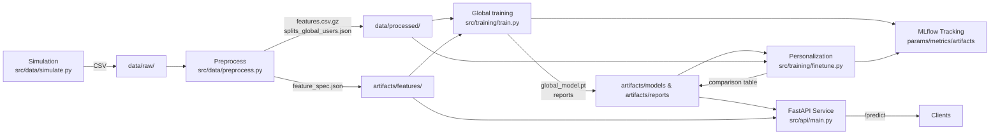

# Personalized Glycemic Forecasting Engine

**Research/engineering demo** for time-series forecasting and MLOps-style system design.  
**Not a medical product**. No medical claims. This project is meant for portfolio-grade ML engineering and performance analytics.

## What this does

- **Simulates** multi-modal wearable time series for 100 users (30 days, 5-minute cadence)
- **Forecasts glucose 2 hours ahead** using multi-feature sequence models
- **Supports personalization** via per-user fine-tuning
- **Tracks experiments** with MLflow (params, metrics, artifacts)
- **Serves predictions** via a FastAPI microservice (`POST /predict`) with a lightweight confidence estimate (MC Dropout)
- **Dockerized** (API + MLflow UI via `docker-compose`)

## Repository structure

```
metabolic-intelligence/
├── data/
│   ├── raw/
│   └── processed/
├── src/
│   ├── data/
│   ├── models/
│   ├── training/
│   ├── inference/
│   ├── api/
│   └── utils/
├── configs/
├── experiments/
├── tests/
├── Dockerfile
├── docker-compose.yml
├── Makefile
├── requirements.txt
└── README.md
```

## System architecture



## Data simulation (multi-modal wearable signals)

Synthetic data contains, per timestamp:

- `glucose` (mg/dL)
- `heart_rate` (bpm)
- `HRV` (ms)
- `sleep_stage` + `sleep_stage_code` (0=awake, 1=light, 2=deep, 3=rem)
- `activity_level` \([0, 1]\)
- `meal_carbs` (grams at meal timestamps, else 0)
- `timestamp`, `user_id`

Simulation includes:

- **Circadian rhythm**
- **Post-meal glucose spikes** (exponential decay response)
- **Sleep impact** (insulin sensitivity modulation)
- **Inter-user variability** (baseline glucose, circadian phase/amplitude, meal response)

## Modeling approach

### Task

Given the last **N time steps** (default: 180 minutes), predict **glucose in 2 hours** (120 minutes) ahead.

### Features

- Raw signals: glucose, HR, HRV, sleep stage code, activity, meal carbs
- **Cyclical time encoding**: hour-of-day and day-of-week (sin/cos)
- **Rolling stats** (per user): rolling mean/std for selected signals across multiple windows
- **Normalization**: leakage-safe standardization computed from training users only (default)

### Models

- **Baseline LSTM** (`src/models/lstm.py`)
- **Simplified Transformer Encoder** (`src/models/transformer.py`)  
  (Transformer encoder + positional encoding + regression head; practical alternative to full TFT for a portfolio demo)

Metrics:

- **MSE** and **MAE**
- **Global evaluation** + **per-user evaluation** (stored as artifacts)

## Personalization strategy

1. **Pretrain global model** on a training set of users (user-level split).
2. For each held-out user:
   - Evaluate **global-only** model on that user’s test time slice.
   - **Fine-tune** on that user’s own early time slice (within-user split) and re-evaluate.
3. Write a **comparison table** (`artifacts/reports/personalization_comparison.csv`) comparing:
   - global-only vs personalized metrics per user
   - average improvements

## Quickstart (local)

### 1) Setup

```bash
cd metabolic-intelligence
cp .env.example .env
make venv
make install
```

### 2) Simulate data

```bash
make simulate
```

Output: `data/raw/synthetic_wearable.csv`

### 3) Preprocess

```bash
make preprocess
```

Outputs:

- `data/processed/features.csv.gz`
- `data/processed/splits_global_users.json`
- `artifacts/features/feature_spec.json`

### 4) Train global model (MLflow tracked)

```bash
make train
```

Outputs:

- `artifacts/models/global_model.pt`
- `artifacts/reports/global_per_user_metrics.json`

### 5) Fine-tune per user and compare

```bash
make finetune
```

Output:

- `artifacts/reports/personalization_comparison.csv`

### 6) Run the API

```bash
make api
```

Then send a request:

```bash
curl -X POST "http://localhost:8000/predict" \
  -H "Content-Type: application/json" \
  -d '{
    "user_id": "user_000",
    "observations": [
      { "timestamp": "2025-01-01T00:00:00", "glucose": 110, "heart_rate": 70, "HRV": 55, "sleep_stage_code": 0, "activity_level": 0.2, "meal_carbs": 0.0 }
    ]
  }'
```

Notes:

- The service expects **at least `window_steps` observations** (default: 36 = 180 minutes at 5-minute cadence).
- Response includes `predicted_glucose_2h` and a simple **uncertainty proxy** via MC Dropout (`confidence_std`, `ci95_*`).

## MLflow

Run MLflow UI locally:

```bash
make mlflow
```

Or with Docker Compose:

```bash
docker compose up --build
```

- MLflow UI: `http://localhost:5000`
- API: `http://localhost:8000`

## Testing

```bash
cd metabolic-intelligence
python -m unittest -v
```

## Results (how to report)

This repo writes:

- **Per-user metrics** for the global model: `artifacts/reports/global_per_user_metrics.json`
- **Personalization comparison table**: `artifacts/reports/personalization_comparison.csv`

These artifacts are what you’d paste into a portfolio write-up (e.g., “global-only vs fine-tuned improvements across held-out users”).

## Future improvements

- Replace the simplified Transformer with a full **Temporal Fusion Transformer** (static covariates, variable selection, gating).
- Add **online learning** / streaming inference with stateful buffers per user.
- Add **calibrated uncertainty** (e.g., conformal prediction, quantile regression).
- Expand simulation with stress, hydration, illness, and sensor dropouts + missingness modeling.
- Add CI (lint/type-check/test), model card, and model registry automation.

## Disclaimer

This is a **synthetic-data** forecasting demo for ML engineering. It is **not** intended for clinical use, diagnosis, treatment, or medical decision-making.

